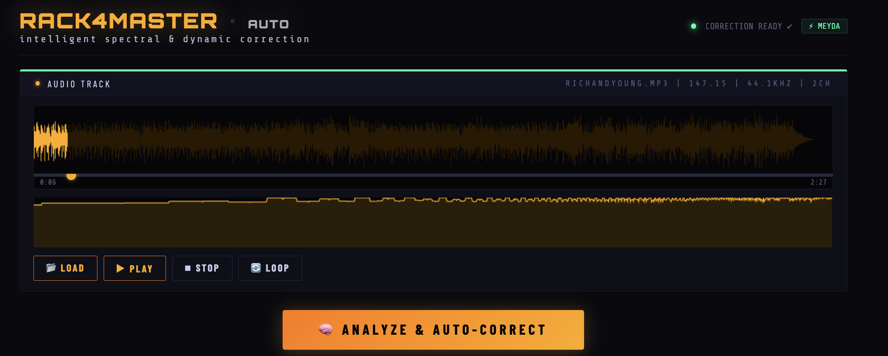
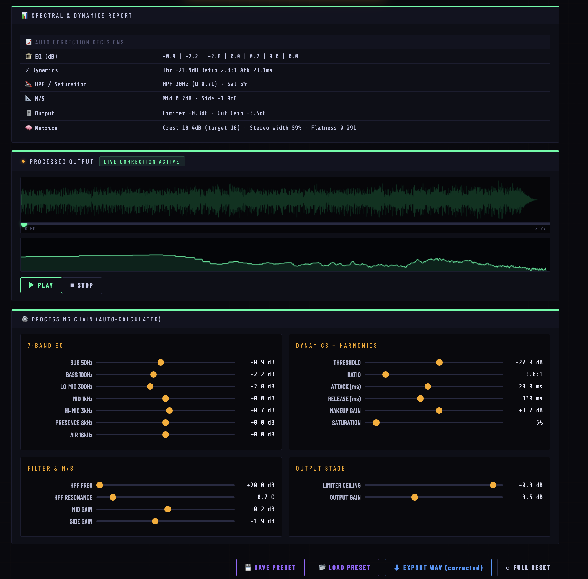

# RACK4MASTER / Auto

> **Spectral Auto Mastering Processor**  
> Intelligent EQ, dynamics and stereo correction that runs entirely in your browser. No uploads, no accounts, no tracking.

---

## ✨ Features

- **Spectral Reference Matching** — auto-matches your track's tonal balance using FFT + Meyda ISO 1/3-octave analysis
- **7-Band Parametric EQ** — sub, bass, lo-mid, mid, hi-mid, presence and air bands (±12 dB)
- **Dynamics Processor** — compressor with threshold, ratio, attack, release and makeup gain
- **HPF + Saturation** — high-pass filter with resonance control and harmonic saturation
- **M/S Output Stage** — independent mid/side gain, limiter ceiling and output gain
- **A/B Comparison** — seamless real-time toggle between original and mastered signal (12 ms crossfade, no position reset)
- **Live DSP Chain** — real-time preview of the processed signal before export; loop button on both original and output players
- **Spectral Comparison View** — overlaid spectrum on both input and output canvases
- **WAV Export** — 16-bit PCM offline render with 0.5 s compressor pre-roll for clean transients
- **Preset system** — save / load processing chains as JSON files
- **Internationalisation** — English · Español · Català via hamburger menu (always starts in English)
- **Donate button** — PayPal link in the footer
- **100% browser** — Web Audio API, zero server-side processing, zero data collection

---

## 📸 Screenshots

  
*Main application window with track loaded.*

  
*Analysis panel showing auto-correction decisions.*

  
*Live DSP chain, A/B button, loop controls and WAV export.*

---

## 🚀 Getting Started

No build step or install required. Just open `index.html` in a modern browser (Chrome / Edge / Firefox / Safari 16+).

---

## 📁 File Structure

```
rack4master-auto/
├── index.html    — Markup only; data-i18n attributes for live translation
├── style.css     — All styles (rack UI, hamburger menu, A/B button, responsive)
├── script.js     — DSP engine, Web Audio graph, UI logic, transport, A/B, export
├── i18n.js       — Translations (EN / ES / CA) + t() / setLang() / initI18n()
├── help.html     — Help page (linked from hamburger menu)
└── README.md     — This file
```

---

## 🎛 A/B Comparison

The **A/B** button in the output transport row toggles between:

| State | Colour | Signal |
|-------|--------|--------|
| **B · MASTERED** | Green | Full DSP chain (EQ + comp + M/S + limiter) |
| **A · ORIGINAL** | Amber | Dry bypass — same source, no processing |

Switching is click-free: a 12 ms gain ramp crossfades between a `dryGain` node (parallel bypass) and the `fadeGain` at the end of the wet chain. Playback position never resets.

---

## 🔁 Loop Controls

Both the **input** and **output** players have independent loop buttons. The output loop wraps the `BufferSource` natively (`src.loop = true`) and the RAF progress display uses modulo so the waveform and seek bar animate correctly through each cycle.

---

## 🌐 Internationalisation

Translations live in `i18n.js` inside the `TRANSLATIONS` object. All three languages (EN / ES / CA) cover the same 71 keys. To add a new language:

1. Add a new key block (e.g. `fr: { ... }`) mirroring the `en` block.
2. Add `<button class="lang-btn" data-lang="fr">FR</button>` inside `.ham-lang` in `index.html`.

Static elements use `data-i18n="key"` (updated by `setLang()`). Dynamic strings — status bar, prompts, report table — call `t('key')` directly in JS.

---

## 🛠 Technical Notes

- **DSP chain**: HPF → 7-band peaking EQ → waveshaper (saturation) → compressor → M/S matrix → limiter → output gain → analyser → fadeGain  
- **Bypass path**: `BufferSource` also connects to `dryGain → destination` in parallel; A/B cross-fades between `fadeGain` and `dryGain`
- **FFT**: custom Cooley–Tukey for spectrum display; Meyda for perceptual analysis
- **Export**: `OfflineAudioContext` with 0.5 s pre-roll silence to warm the compressor envelope, then trimmed before WAV encoding
- **No frameworks** — vanilla JS, zero dependencies beyond Meyda CDN
